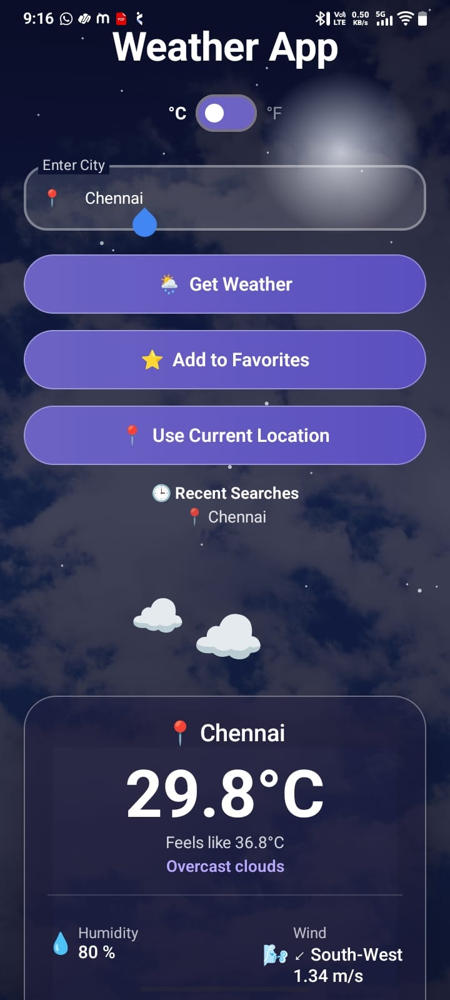

# 🌦️ Weather App

A modern Android Weather Application built using **Kotlin** and **Jetpack Compose** that provides real-time weather information, hourly forecasts, 5-day forecasts, air quality, and current location support using the OpenWeatherMap API.

---

## 📱 Screenshots

### 🏠 Home Page


### 📍 Current Location


### 🔍 City Search


### ⭐ Favourite Cities


### ⏰ Hourly & 5-Day Forecast


### 💡 Weather Tip


### 🌡️ Celsius to Fahrenheit Conversion


# ✨ Features

- 🌍 Search weather by city name
- 📍 Current location weather
- 🌡️ Temperature in Celsius & Fahrenheit
- ☁️ Weather condition
- 💧 Humidity
- 🌬️ Wind speed & direction
- 🌅 Sunrise & Sunset time
- 🌿 Air Quality Index (AQI)
- ⭐ Add to Favorites
- 🕒 Recent Searches
- ⏰ Hourly Forecast
- 📅 5-Day Forecast
- 💡 Smart Weather Tips
- 🎨 Modern Glassmorphism UI

---

# 🛠️ Technologies Used

- Kotlin
- Jetpack Compose
- Android Studio
- Retrofit
- Kotlin Coroutines
- OpenWeatherMap API
- Fused Location Provider
- Coil Image Loading

---

# 📂 Project Structure

```
WeatherApp
│
├── MainActivity.kt
├── WeatherApi.kt
├── RetrofitInstance.kt
├── WeatherResponse.kt
├── ForecastResponse.kt
├── AirQualityResponse.kt
└── UI Components
```

---

# ⚙️ Installation

1. Clone the repository

```
git clone https://github.com/theja2005-GIT/WeatherApp.git
```

2. Open the project in Android Studio.

3. Get your API key from OpenWeatherMap.

4. Replace the API key in MainActivity.kt.

5. Run the application.

---

# 🌐 API Used

OpenWeatherMap API

- Current Weather API
- Forecast API
- Air Pollution API

---

# 🚀 Future Improvements

- 🌙 Dark Mode
- 🔔 Weather Notifications
- 🗺️ Weather Maps
- 🌈 Dynamic Backgrounds
- 🌎 Multiple Language Support
- 📲 Home Screen Widget
- 📡 Offline Weather Cache

---

# 👨‍💻 Developer

**Rithik**

MCA Student | Android Developer | Kotlin Learner

GitHub:
https://github.com/theja2005-GIT

LinkedIn:
https://www.linkedin.com/in/thejasree2206

---

# ⭐ If you like this project, don't forget to Star the repository!
